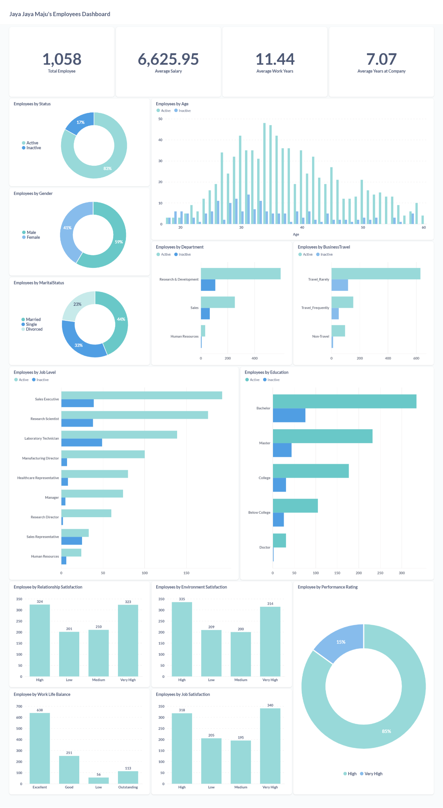

## Employee Attrition Prediction Using Random Forest Algorithm

### **Business Understanding**

**Latar Belakang Bisnis**  
Jaya Jaya Maju adalah perusahaan besar dengan lebih dari 1.000 karyawan di berbagai divisi. Perusahaan ini ingin memahami kondisi tenaga kerja untuk meningkatkan kesejahteraan karyawan sekaligus mempertahankan performa operasional yang optimal.  

**Permasalahan Bisnis**  
1. Tingkat attrition yang tinggi (lebih dari 10%) menimbulkan tantangan dalam operasional dan meningkatkan biaya rekrutmen.  
2. Manajer HR memerlukan wawasan mendalam terkait faktor-faktor yang memengaruhi turnover karyawan.  

**Tujuan Proyek**  
1. Memberikan insight terkait profil dan distribusi karyawan.  
2. Mengidentifikasi area kritis untuk meningkatkan kesejahteraan karyawan.  
3. Memberikan rekomendasi strategis berbasis data untuk mengurangi turnover.  

---

### **Cakupan Proyek**

- Analisis data terkait profil karyawan, distribusi, dan kepuasan kerja.  
- Identifikasi pola yang memengaruhi turnover karyawan.  
- Pengembangan business dashboard sebagai alat bantu visualisasi data.  

---

## Persiapan  
### **Sumber data**  
Dataset :
[Jaya Jaya Maju Dataset](https://github.com/dicodingacademy/dicoding_dataset/tree/main/employee)  

### **Setup Environment**  

1. **Install Docker (Jika Belum Terpasang)**  
   - Unduh dan instal Docker sesuai dengan sistem operasi:  
     - Windows: [Docker Desktop](https://www.docker.com/products/docker-desktop)  
     - MacOS: [Docker Desktop](https://www.docker.com/products/docker-desktop)  
     - Linux:  
       ```bash  
       sudo apt-get update  
       sudo apt-get install docker-ce docker-ce-cli containerd.io  
       ```  

2. **Menjalankan Metabase dengan Docker**  
   - Jalankan perintah berikut untuk menarik dan menjalankan Metabase:  
     ```bash  
     docker pull metabase/metabase:v0.46.4  
     docker run -p 3000:3000 --name metabase metabase/metabase  
     ```  
   - Akses Metabase di browser melalui: [http://localhost:3000/setup](http://localhost:3000/setup)
  
3. **Supabase Database Connection**
   - Buat akun di Supabase dan buat proyek baru.
   - Catat Database URL, Username, dan Password dari project settings.
   - Pastikan Supabase database Anda sudah di-seed dengan data yang relevan.

3. **Instalasi Python dan Library Pendukung**  
   - Pastikan Python 3.8 atau lebih baru telah terinstal di komputer Anda.  
   - Instal library yang dibutuhkan menggunakan pip:  
     ```bash  
     pip install pandas numpy scikit-learn matplotlib seaborn joblib tabulate  
     ```
4. **Integrasi Metabase dengan Supabase**
   - Di Metabase, tambahkan data source baru dan pilih PostgreSQL.
   - Masukkan informasi dari Supabase (host, port, database name, username, dan password).
   - Uji koneksi sebelum melanjutkan.
  
5. **Informasi Login Metabase**
   - Email: evelinsitanggang@gmail.com
   - Password: Batudewa22_

---

## Business Dashboard

Dashboard ini menyajikan data utama terkait karyawan perusahaan Jaya Jaya Maju:



### **KPI Utama**
- **Total Karyawan:** 1,058 orang.
- **Rata-rata Gaji Karyawan:** 6,625.95 USD.
- **Rata-rata Masa Kerja:** 11.44 tahun.
- **Rata-rata Tahun di Perusahaan:** 7.07 tahun.

### **Distribusi Karyawan**
1. **Status Karyawan:**
   - 83% aktif, sedangkan 17% sudah tidak aktif.
2. **Gender:**
   - 59% perempuan, 41% laki-laki.
3. **Status Pernikahan:**
   - 44% menikah, 33% single, dan 23% lainnya (cerai/duda/janda).
4. **Departemen:**
   - **Research & Development (R&D):** Departemen dengan jumlah karyawan tertinggi.
   - **Sales dan Human Resources:** Memiliki jumlah karyawan yang relatif lebih sedikit.
5. **Usia Karyawan:**
   - Mayoritas berada di rentang usia **30-40 tahun**, mencerminkan dominasi usia produktif.
6. **Tingkat Pendidikan:**
   - Sebagian besar karyawan berpendidikan Sarjana (Bachelor's Degree).
7. **Kepuasan Lingkungan Kerja:**
   - 314 karyawan merasa "Very High", tetapi ada 200 karyawan yang merasa kurang puas (kategori "Low").
8. **Work-Life Balance:**
   - 638 karyawan berada di kategori "Excellent", tetapi 56 karyawan melaporkan kategori "Outstanding", menunjukkan ruang peningkatan.

---

## Kesimpulan

1. **Pengaruh Level Jabatan:**
   Sebagian besar karyawan yang keluar berasal dari level jabatan rendah, seperti **Sales Executive** dan **Laboratory Technician**, yang memiliki jumlah terbanyak di perusahaan. Level jabatan rendah ini biasanya diikuti oleh gaji yang lebih rendah, yang berkontribusi pada risiko turnover. Rata-rata gaji karyawan perusahaan adalah **6,625.95 USD**, namun sebagian besar karyawan di level jabatan ini memiliki gaji di bawah rata-rata.

2. **Distribusi Usia dan Risiko Turnover:**
   Mayoritas karyawan yang keluar berada pada rentang usia **30–40 tahun**, yaitu usia produktif yang sering kali lebih terbuka terhadap peluang karier baru. Rentang usia ini memerlukan perhatian khusus untuk strategi retensi, seperti program pengembangan karier dan kenaikan gaji berbasis kinerja, guna mengurangi turnover.

3. **Departemen dengan Risiko Tinggi:**
   Departemen **Research & Development**, yang memiliki jumlah karyawan terbanyak, menunjukkan potensi risiko turnover yang tinggi. Beban kerja yang besar, dikombinasikan dengan kemungkinan gaji yang tidak sebanding dengan tanggung jawab, bisa menjadi salah satu alasan turnover di departemen ini. Peninjauan beban kerja dan pemberian insentif tambahan dapat membantu mengurangi risiko ini.

4. **Kepuasan Karyawan:**
   Tingkat kepuasan kerja menunjukkan bahwa mayoritas karyawan memiliki kepuasan yang tinggi hingga sangat tinggi. Namun, terdapat **15% karyawan** dengan penilaian kinerja yang rendah, yang berpotensi keluar jika tidak ada upaya untuk memenuhi kebutuhan mereka. Hal ini menunjukkan pentingnya survei kepuasan karyawan yang lebih mendalam untuk mengidentifikasi area yang perlu diperbaiki.

5. **Pendapatan:**
   Karyawan yang keluar cenderung memiliki gaji di bawah rata-rata perusahaan (**6,625.95 USD**). Distribusi ini menunjukkan bahwa peningkatan struktur gaji, terutama di level jabatan rendah, dapat menjadi langkah penting untuk mengurangi turnover.

---

## Rekomendasi

1. **Meningkatkan Keseimbangan Beban Kerja:**
   - Distribusi kerja antar departemen perlu dievaluasi, terutama antara R&D dan departemen lainnya.
2. **Program Retensi Karyawan Usia Produktif:**
   - Memberikan bonus berbasis kinerja, pelatihan karier, dan rencana jenjang karier untuk menjaga loyalitas karyawan.
3. **Meningkatkan Kepuasan Kerja:**
   - Fokus pada survei kebutuhan karyawan dan pengembangan program kesejahteraan (seperti rekreasi kantor dan fleksibilitas waktu kerja).
4. **Pengembangan Kompetensi Departemen Lain:**
   - Departemen Sales dan HR dapat diberikan pelatihan tambahan untuk meningkatkan kontribusinya dalam pertumbuhan perusahaan.

Dengan langkah-langkah ini, Jaya Jaya Maju dapat mengatasi permasalahan bisnis yang ada dan meningkatkan kinerja serta kesejahteraan karyawan secara menyeluruh.

--- 

## Implementasi Model

Berikut langkah-langkah sederhana yang bisa diikuti oleh pihak HRD untuk memprediksi tingkat attrition karyawan menggunakan model ini:

### **Langkah-Langkah Penggunaan Model Prediksi untuk HRD**

1. **Persiapkan File Data Karyawan**
   - File Excel atau CSV yang berisi data karyawan yang ingin diprediksi.
   - Pastikan data memiliki kolom berikut:
     - **EmployeeId**: ID unik karyawan.
     - **BusinessTravel**, **Department**, **Education**, **EducationField**, dan kolom lainnya yang relevan sesuai format.
   - Simpan file dengan nama, misalnya `karyawan_predict.csv`.

2. **Persiapkan Environment Kerja**
   - Siapkan komputer dengan Python 3.7+ terinstal. Jika Python belum terpasang, download di [python.org](https://www.python.org/).
   - Pastikan Anda memiliki akses ke folder kerja yang berisi:
     - File **`predict_attrition.py`** (script prediksi).
     - File **`random_forest.joblib`** (model prediksi).

3. **Install Aplikasi Pendukung**
   - Buka aplikasi **Command Prompt (CMD)** atau **Terminal**.
   - Masuk ke folder kerja Anda:
     ```bash
     cd path/to/folder_kerja
     ```
   - Install library Python yang diperlukan dengan perintah:
     ```bash
     pip install pandas scikit-learn tabulate joblib
     ```

4. **Jalankan Proses Prediksi**
   - Masih di terminal, jalankan script prediksi:
     ```bash
     python predict_attrition.py
     ```
   - Script akan meminta path file data karyawan yang ingin diprediksi. Ketik nama file atau path lengkap, misalnya:
     ```
     Masukkan path file CSV: karyawan_predict.csv
     ```
   - Hasil prediksi akan ditampilkan langsung di terminal dalam format tabel. Contoh:
     
      |  | EmployeeId | Attrition_Prediction|
      |--|------------|---------------------|
      |0 |          2 | No                  |
      |1 |          7 | No                  |
      |2 |          8 | No                  |
      |3 |         12 | No                  |
      |4 |        290 | No                  |
      |5 |        409 | Yes                 |
   

5. **Simpan Hasil Prediksi**
   - Hasil prediksi akan otomatis disimpan dalam file `result_predictions.csv` di folder yang sama.
   - File ini dapat dibuka menggunakan aplikasi seperti Microsoft Excel untuk analisis lebih lanjut.

6. **Gunakan Data Hasil Prediksi**
   - **EmployeeId** akan menunjukkan ID karyawan.
   - **Attrition_Prediction** akan menunjukkan prediksi apakah karyawan berpotensi keluar:
     - `Yes`: Karyawan berpotensi keluar.
     - `No`: Karyawan tidak berpotensi keluar.

---

### **Contoh Workflow untuk HRD**
1. **Menyiapkan Data**:
   - HRD membuat file Excel bernama `karyawan_predict.csv` dengan data karyawan.
   
2. **Menjalankan Prediksi**:
   - Buka terminal dan jalankan perintah prediksi sesuai langkah di atas.

3. **Menganalisis Hasil**:
   - Buka file hasil prediksi `result_predictions.csv`.
   - Gunakan hasil untuk menentukan tindakan seperti:
     - Memberikan pelatihan.
     - Melakukan wawancara internal untuk mengatasi ketidakpuasan.


##### Proyek 1 Belajar Penerapan Data Science
